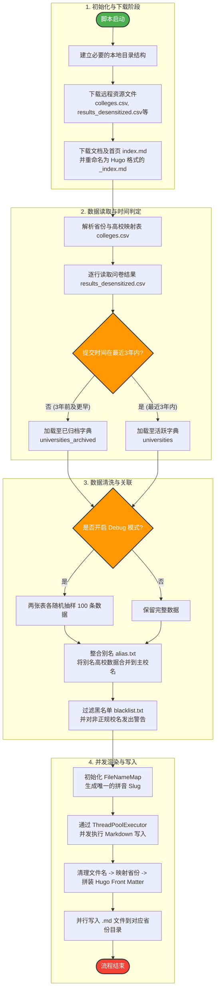

## Debug

使用 mock 数据生成 v2 报告：

```bash
python -m generator debug
```

也可以在 `debug` 后传入一份问卷星导出的 CSV 或 Excel 文件，文件中的答卷会按学校合并到 mock 数据中：

```bash
python -m generator debug ./responses.csv
python -m generator debug ./responses.xlsx
```
